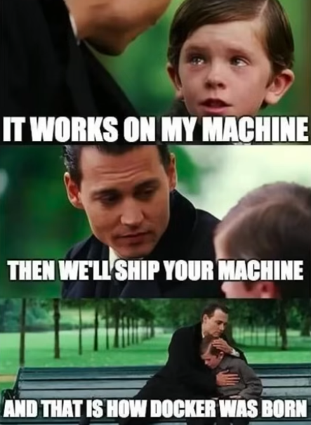

# Inception

*This project has been created as part of the 42 curriculum by fpapadak.*

## Table of Contents

- [Description](#description)
- [Features](#features)
- [Instructions](#instructions)
- [Resources](#resources)

## Description



### Brief Overview

Inception is a system administration project that challenges you to virtualize a complete web infrastructure using Docker containers. The goal is to set up a functional, isolated environment running multiple interconnected services that together form a WordPress website.

The project's name "inception", implies its required architecture: We are going to use a Virtual machine and inside of it, we are going to use Docker containers. So essentially, we are using an isolated computer system, which will include isolated application environments.

### Docker Usage

Using docker containers, we deploy three interconnected services:

- NGINX as a secure reverse proxy with TLS termination
- WordPress + php-fpm as the content management system
- MariaDB as the persistent database backend

```
┌──────────────────────────────────────────────┐ ```
│             DOCKER CONTAINERS                │ ```
├─────────────┬───────────────┬────────────────┤ ```
│   WEB LAYER │   APP LAYER   │   DATA LAYER   │ ```
│   NGINX     │   WordPress   │   MariaDB      │ ```
│   (Reverse  │    (CMS)      │   (Database)   │ ```
│    Proxy &  │               │                │ ```
│    SSL)     │               │                │ ```
└───────┬─────┴───────┬───────┴──────┬─────────┘ ```
        │             │              │			 ```
        └─────────────┼──────────────┘			 ```
                      │							 ```
        Docker Network: inception (bridge)		 ```
```	
For this project, we are working with Dockers for the following reasons:

- Our services (NGINX, WordPress, MariaDB) don't require complete OS isolation.
- Docker provides sufficient security isolation for web applications.
- Containers start quickly, making it more efficient for development and testing.
- The lightweight nature reduces resource usage on the host VM.
- Docker Compose simplifies multi-container management.

### Sources Included in the Project

The project repository contains:

- Dockerfiles (srcs/requirements/[service]/Dockerfile):

1. Custom NGINX image with TLS configuration
2. WordPress image with php-fpm optimization
3. MariaDB image with secure initialization

- Configuration Files:

1. NGINX site configuration with SSL/TLS settings
2. MariaDB initialization scripts
3. php-fpm configuration for WordPress

- Orchestration Files:

1. docker-compose.yml: Defines services, networks, volumes
2. .env: Environment variables (credentials, domain names)

- Makefile: Automation for building and managing the stack

- Security Files:

1. Secrets management using Docker secrets
2. SSL certificate generation scripts
3. Environment variable templates


### Main Design Choices

- **Container-per-Service**: Each component in its own container
- **Custom Images**: Built from Debian stable versions
- **Network Isolation**: Custom bridge network with NGINX as sole entry point
- **Data Persistence**: Named volumes with bind mounts for backup
- **Security**: TLSv1.2/1.3, Docker secrets, non-root execution
- **Automation**: Makefile for one-command deployment

### Virtual Machines vs Docker

Virtual machines are designed to emulate a complete OS environment on virtualized hardware. This provides a strong isolation, but comes with significant resource usage, as each VM requires a full OS installation.

A Docker is not a Virtual machine. Unlike VMs, a Docker uses container images which are lightweigt, standalone, executable packages of software which include everything needed in order to run an application. Such packages could involve software dependencies and the application code itself. Multiple copies of the application can be run by allowing the container to run x copies. For better understanding, the container images can be compared to OOP; container images = class, container = instance of that class. Docker container images follow the OCI (Open Container Initiative).

Virtual machines run their own copy of the Linux kernel (OS), while Docker containers are sharing the kernel with the host OS. Containers provide isolated filesystems, networks, and process spaces, but share the host kernel. In other words, they operate in the same OS.


### Secrets vs Environment Variables
### Docker Network vs Host Network
### Docker Volumes vs Bind Mounts


## Features

Feature list


## Instructions

A section containing any relevant information about compilation, installation, and/or execution

## Resources

- https://github.com/sidpalas/devops-directive-docker-course

A section listing classic references related to the topic (documentation, articles, tutorials, etc.), as well as a description of how AI was used —
specifying for which tasks and which parts of the project.
